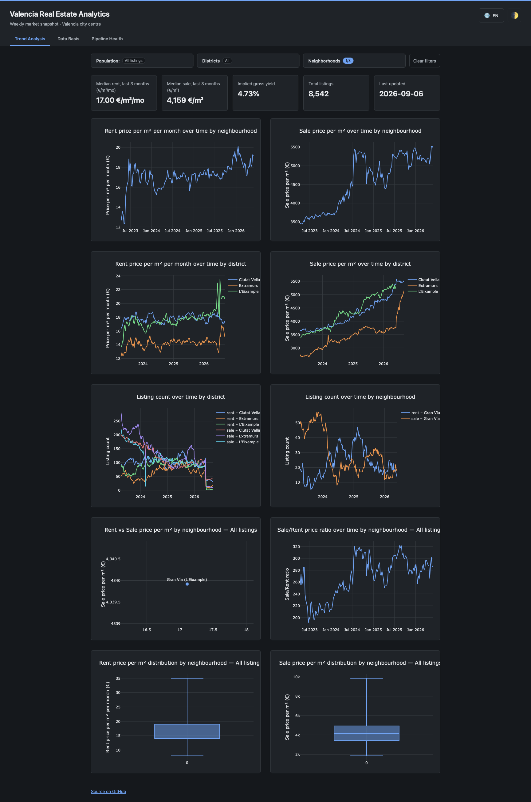

# VLC Market Pulse

Cloud-hosted serverless price-trend analytics for the Valencia real-estate market. A fully automated data pipeline has collected a weekly price history since 2023 and automatically updates it to a live public dashboard every week. The complete project results in about €3/month cloud costs, with no servers to maintain.

## Why It Exists

Valencia's property market is opaque: asking prices drift weekly, listings vanish, and there is no free, reliable source for how €/m² actually trends per neighbourhood over time. This platform turns that guesswork into a multi-year evidence base for buy, rent, and invest timing, collected automatically every week, and impossible to reconstruct by hand after the fact.

## Live Dashboard

Link: **[vlc-market-pulse.leopoldwalther.com](https://vlc-market-pulse.leopoldwalther.com)**



A static single-page app (Plotly.js, no backend) served from CloudFront over a private S3 bucket. It reads the cleaned collected data and lets you filter by up to three districts or neighbourhoods. Three tabs:

- **Trend Analysis Tab** — the multi-year price story: KPI cards (median rent/sale €/m², implied gross yield, listing count) plus charts for rent and sale €/m² by neighbourhood and district, listing-count trends, rent-vs-sale yield, and per-neighbourhood box plots.
- **Data Basis Tab** — an overview on which data is the basis for the trend analysis and how the data was collected: the Idealista search parameters, a street map of recent listings, weekly collection volume, and price/size/room distributions.
- **Pipeline Health** — a monitoring of the data pipeline health visualized with traffic-light views. An independent monitoring Lambda tracks execution success, run duration, API-quota usage, and AWS spend, each with a history chart.

## What It Demonstrates

Small in surface area, production-shaped end to end:

- **AWS · Serverless · IaC** — event-driven Lambdas on EventBridge, least-privilege IAM, encrypted S3, Secrets Manager and SNS, all in reusable Terraform modules across isolated dev/prod.
- **Data Engineering** — a Bronze → Silver → Gold medallion pipeline: raw JSON to cleaned Hive-partitioned Parquet to an analytics-ready JSON contract.
- **Clean Code · SOLID** — domain logic kept off the AWS edges: dependencies injected, SDKs behind project-owned interfaces, interchangeable strategies per chart and aggregation.
- **TDD · CI/CD** — RED → GREEN → REFACTOR with >80% coverage, enforced by pre-commit (black, ruff, mypy) and GitHub Actions (pytest + Terraform validate).

## How It Works

Every Sunday, three scheduled Lambdas run in sequence and the dashboard updates itself — no manual steps.

```
EventBridge → Bronze Collector → S3 bronze/  (raw JSON from the Idealista API)
            → Silver Cleaner    → S3 silver/  (cleaned, Hive-partitioned Parquet)
            → Gold Aggregator   → S3 gold/    (aggregated JSON contract)
                                       ↓
                        CloudFront + private S3 static dashboard
```

| Layer | S3 prefix | Format | Written by |
|---|---|---|---|
| Bronze | `bronze/idealista/{op}_{date}_{page}.json` | Raw JSON | Bronze Collector |
| Silver | `silver/idealista/operation={op}/snapshot_date=…/part.parquet` | Parquet | Silver Cleaner |
| Gold | `gold/aggregations/latest.json` | JSON | Gold Aggregator |

**Stack:** Python 3.12 · AWS Lambda, S3, EventBridge, Secrets Manager, SNS, CloudWatch · Terraform · Idealista API v3.5 · Plotly.js. Runs in eu-central-1 with S3 encrypted at rest and credentials in Secrets Manager.

Key choices: **serverless** (a weekly, bursty job that scales to zero, ~€3/month); **medallion architecture** (immutable raw history, reproducible cleaning, a stable analytics contract — any layer rebuilds from the one below); **S3 instead of a database** (cheap, durable, ideal for immutable snapshots); and a **static, backend-free dashboard** (pre-aggregated JSON, nothing to run or attack).

## Sister Project — vlc-price-estimator

The scalable counterpart to this repo: instead of the quota-limited Idealista API, it web-scrapes the full Comunidad Valenciana inventory on ECS/Fargate for price estimation and ML. Together they show the same market as a cheap trend engine and a scalable intelligence engine.

## Getting Started

```bash
git clone https://github.com/LeopoldWalther/vlc-market-pulse.git
cd vlc-market-pulse
python3 -m venv .venv && source .venv/bin/activate
pip install -r src/etl/requirements-dev.txt
pre-commit install

# Run the test suite
cd src/etl && pytest data_collection/tests/ data_processing/tests/ -v --cov
```

Deploy per environment (needs a gitignored `secrets.tfvars` with your Idealista credentials):

```bash
cd infrastructure/environments/dev   # or prod
terraform init
terraform apply -var-file="secrets.tfvars"
```

Dev runs the collector in `test_mode` (1 page per operation) to stay within API limits; prod runs full collection. Per-layer detail lives in [DATA_COLLECTION_LAYER.md](documentation/DATA_COLLECTION_LAYER.md), [DATA_PROCESSING_LAYER.md](documentation/DATA_PROCESSING_LAYER.md), and [PIPELINE_HEALTH_LAYER.md](documentation/PIPELINE_HEALTH_LAYER.md).

## License

MIT — see [LICENSE](LICENSE).
